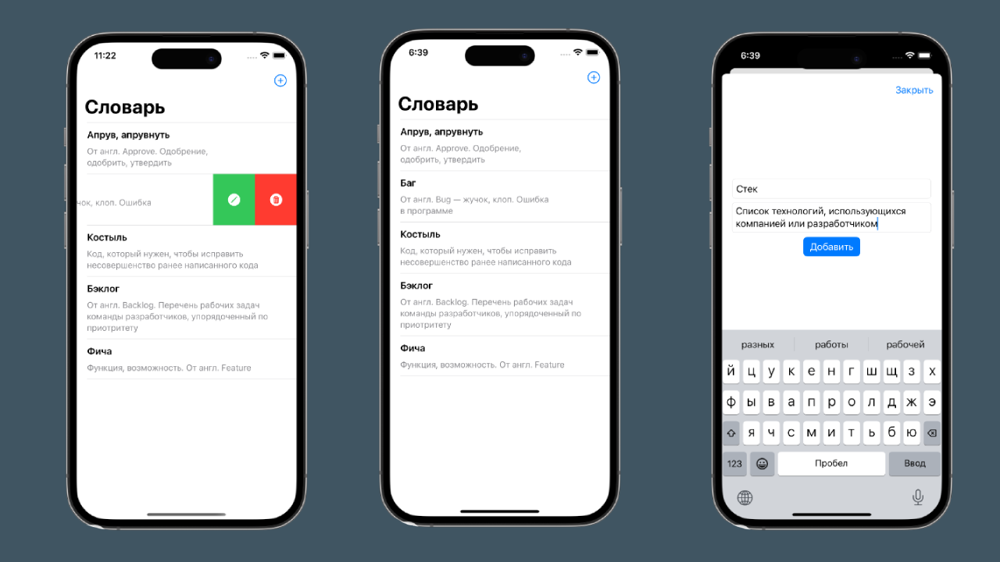

# Учебный проект "Словарь"

"Словарь" - это кроссплатформенное мобильное приложение, которое позволяет 
совместно собирать различные словари: получать и добавлять пары слово-значение, 
а также принимать/отклонять добавленные другими пользователями пары слово-значение

## Визуальная схема фронтенда

## Документация

1. Маркетинг
   1. [Заинтересанты](docs/01-marketing/01-stakeholders.md)
   2. [Целевая аудитория](docs/01-marketing/02-target-audience.md)
   3. [Пользовательские истории](docs/01-marketing/03-user-stories.md)
2. DevOps
   1. [Схема инфраструктуры](./docs/02-devops/01-infrastruture.md)
   2. [Схема мониторинга](./docs/02-devops/02-monitoring.md)
3. Тесты
4. Архитектура
   1. [Компонентная схема](./docs/04-architecture/01-arch.md)
   2. [Интеграционная схема](./docs/04-architecture/02-integration.md)
   3. [Описание API](./docs/04-architecture/03-api.md)